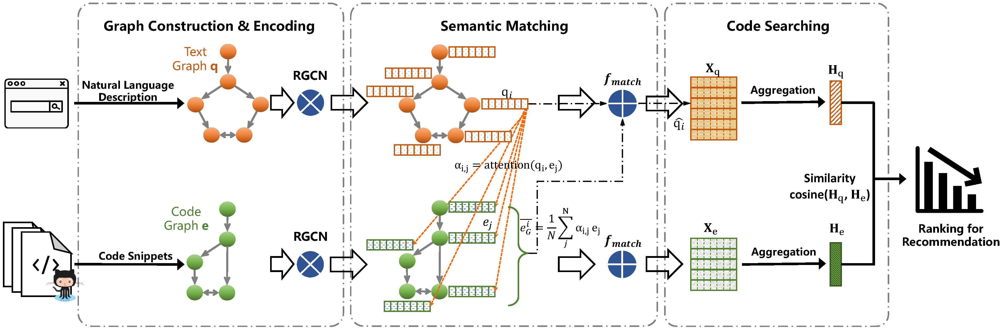

# Deep Graph Matching and Searching for Semantic Code Retrieval

## 1. Description

In this paper, we propose an end-to-end [Deep Graph Matching and Searching (**DGMS**) model](https://dl.acm.org/doi/abs/10.1145/3447571) for the task of semantic code retrieval. Specifically, we first represent both natural
language query texts and programming language codes with the unified graph structured data, and then use the proposed graph matching and searching model to retrieve the best
matching code snippet.


### 1.1 citation:

Xiang Ling, Lingfei Wu, Saizhuo Wang, Gaoning Pan, Tengfei Ma, Fangli Xu, Alex X. Liu, Chunming Wu, and Shouling Ji, **Deep Graph Matching and Searching for Semantic Code Retrieval**, ACM Transactions on Knowledge Discovery from Data (**TKDD**), 2021, 15(5): 1-21.

 ``` 
  @article{ling2020deep,
    title={Deep Graph Matching and Searching for Semantic Code Retrieval},
    author={Ling, Xiang and Wu, Lingfei and Wang, Saizhuo and Pan, Gaoning and Ma, Tengfei and Xu, Fangli and Liu, Alex X and Wu, Chunming and Ji, Shouling},
    journal={ACM Transactions on Knowledge Discovery from Data (TKDD)},
    volume={15},
    number={5},
    publisher={ACM},
    url={https://dl.acm.org/doi/10.1145/3447571},
    year={2021}
  }
 ```

### 1.2 glance:

```
├─── src
│    ├─── model
│    │    ├─── GraphMatchModel.py
│    ├─── config.py
│    ├─── ProcessedDataset.py
│    ├─── train.py
│    ├─── utils.py
├─── Dataset
│    ├─── java
│    │    ├─── code_graph_ids.pt
│    │    ├─── code_processed
│    │    │    ├─── code_100000.pt
│    │    │    ├─── ...
│    │    ├─── text_graph_ids.pt
│    │    ├─── text_processed
│    │    │    ├─── text_100000.pt
│    │    │    ├─── ...
│    │    ├─── split.json
│    ├─── python
│    │    ├─── code_graph_ids.pt
│    │    ├─── code_processed
│    │    │    ├─── code_100000.pt
│    │    │    ├─── ...
│    │    ├─── text_graph_ids.pt
│    │    ├─── text_processed
│    │    │    ├─── text_100000.pt
│    │    │    ├─── ...
│    │    ├─── split.json
```

We build our model on the graph representation of the source code or description text and save each graph representation with ``torch_geometric.data.Data`` (PyTorch_Geometric). To
be specific, each ``code/text_X.pt`` in ``text/code_processed`` folder is the saved graph representation of one text/code graph whose index is `X`. The total size of two datasets
is over 100G, please download the zipped files from Baidu NetDisc and unzip them into the corresponding folder in this repo.

> NetDisc Link: https://pan.baidu.com/s/1CbzQWireoH5hMopK3CRZOw
> Extraction code: 9xz5 

## 2. Example of usage

- **Step 1**: All hyper-parameters of our model can be found and customized in the `config.py` file. For instance, the employed graph neural network, the semantic matching 
  operation, the aggregation function, number of training iterations, etc.

- **Step2**: Examples of training & testing scripts are given as follows.
```shell
# java
python main.py --conv='rgcn' --filters='100' --match='submul' --match_agg='fc_max' --margin=0.5 --max_iter=216259 --val_start=100000 --valid_interval=10000 --log_dir='../JavaLogs/' --data_dir='../Datasets/java/'
# python
python main.py --conv='rgcn' --filters='100' --match='submul' --match_agg='fc_max' --margin=0.5 --max_iter=312189 --val_start=150000 --valid_interval=15000 --log_dir='../PythonLogs/' --data_dir='../Datasets/python/'
```
